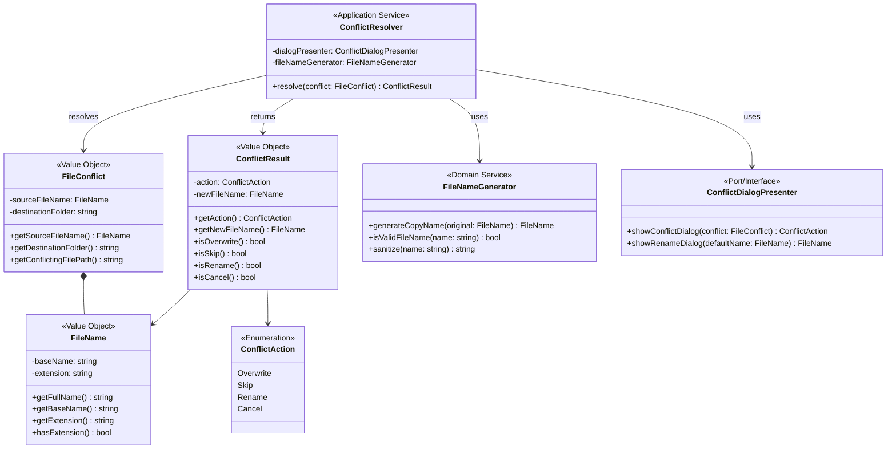
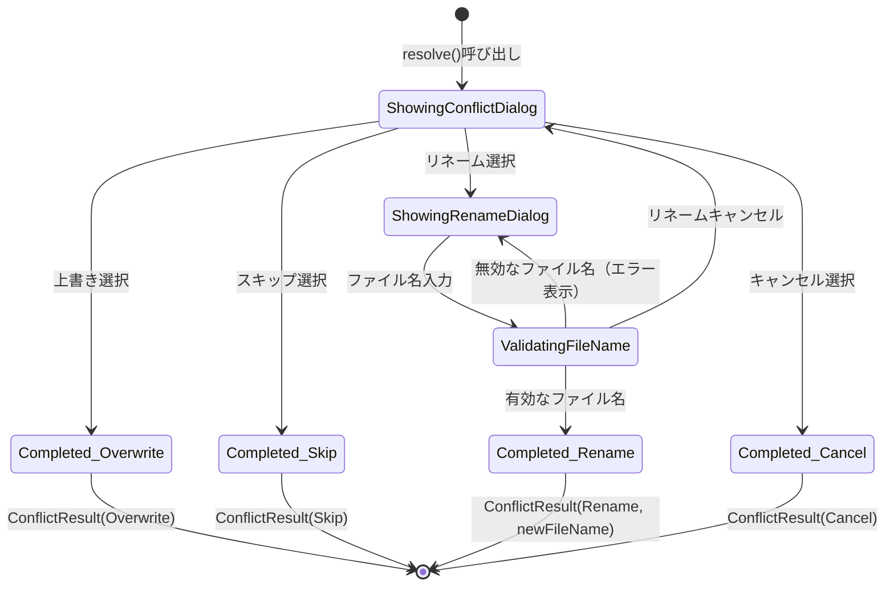

# Unit: 競合解決

## 概要
移動先に同名ファイルが存在する場合の確認ダイアログと、ユーザー選択に基づく処理を行う機能。

## 関連ユーザーストーリー
- US-004: 同名ファイル存在時に対処方法を選択する

## スコープ

### 含まれる機能
- 同名ファイル確認ダイアログの表示
- リネームダイアログの表示
- ユーザー選択に基づく処理（上書き、スキップ、リネーム、キャンセル）
- 新しいファイル名の生成（リネーム時のデフォルト名）

### 含まれない機能
- 同名ファイルの検出（Unit: ファイル移動から呼び出される）
- 実際のファイル上書き・移動処理（Unit: ファイル移動に結果を返す）

## 技術仕様

### インターフェース
```
ConflictResolver
├── resolve(conflict: FileConflict): ConflictResult
├── ConflictResult
│   ├── action: ConflictAction (Overwrite, Skip, Rename, Cancel)
│   └── newFileName: FileName (リネーム時のみ使用)
└── FileConflict
    ├── sourceFileName: FileName
    └── destinationFolder: string
```

### 処理フロー
```
1. 同名ファイル確認ダイアログを表示
2. ユーザーがオプションを選択
   ├── 上書き → ConflictResult(Overwrite)を返す
   ├── スキップ → ConflictResult(Skip)を返す
   ├── リネーム → リネームダイアログを表示 → 3へ
   └── キャンセル → ConflictResult(Cancel)を返す
3. リネームダイアログ
   ├── OK → ConflictResult(Rename, newFileName)を返す
   └── キャンセル → 1に戻る
```

## UI仕様

### 同名ファイル確認ダイアログ
```
┌─────────────────────────────────────────────────────────┐
│  ⚠ ファイルの競合                                 [×]  │
├─────────────────────────────────────────────────────────┤
│                                                         │
│  移動先に同じ名前のファイルが既に存在します。          │
│                                                         │
│  ファイル名: {ファイル名}                               │
│  移動先: {移動先パス}                                   │
│                                                         │
│  どのように処理しますか？                               │
│                                                         │
│  ┌─────────────────────────────────────────────────┐   │
│  │ ○ 上書き - 既存のファイルを置き換える          │   │
│  │ ○ スキップ - このファイルの移動をスキップする  │   │
│  │ ○ リネーム - 新しい名前を付けて移動する        │   │
│  └─────────────────────────────────────────────────┘   │
│                                                         │
│              [ OK ]           [ キャンセル ]            │
│                                                         │
└─────────────────────────────────────────────────────────┘
```

### リネームダイアログ
```
┌─────────────────────────────────────────────────────────┐
│  📝 ファイル名の変更                              [×]  │
├─────────────────────────────────────────────────────────┤
│                                                         │
│  新しいファイル名を入力してください：                   │
│                                                         │
│  ┌─────────────────────────────────────────────────┐   │
│  │ {ファイル名}_copy.{拡張子}                      │   │
│  └─────────────────────────────────────────────────┘   │
│                                                         │
│              [ OK ]           [ キャンセル ]            │
│                                                         │
└─────────────────────────────────────────────────────────┘
```

### デフォルトファイル名生成ルール
- 元ファイル名: `example.txt` → デフォルト: `example_copy.txt`
- 元ファイル名: `document.pdf` → デフォルト: `document_copy.pdf`
- 元ファイル名: `archive` (拡張子なし) → デフォルト: `archive_copy`

## 受け入れ条件
- [ ] 同名ファイル存在時に確認ダイアログが表示される
- [ ] ダイアログに上書き、スキップ、リネーム、キャンセルのオプションが表示される
- [ ] 上書き選択時、Overwriteアクションが返される
- [ ] スキップ選択時、Skipアクションが返される
- [ ] リネーム選択時、リネームダイアログが表示される
- [ ] リネームダイアログにデフォルトファイル名が表示される
- [ ] リネームダイアログでOK選択時、Renameアクションと新ファイル名が返される
- [ ] リネームダイアログでキャンセル選択時、確認ダイアログに戻る
- [ ] キャンセル選択時、Cancelアクションが返される

## テスト観点
| テストケース | 期待結果 |
|-------------|---------|
| 上書き選択 | Overwriteアクションが返される |
| スキップ選択 | Skipアクションが返される |
| リネーム選択→新ファイル名入力→OK | Renameアクションと新ファイル名が返される |
| リネーム選択→キャンセル | 確認ダイアログに戻る |
| キャンセル選択 | Cancelアクションが返される |
| デフォルトファイル名生成（拡張子あり） | `{name}_copy.{ext}`形式 |
| デフォルトファイル名生成（拡張子なし） | `{name}_copy`形式 |
| リネームで空ファイル名 | OKボタン無効化またはエラー表示 |
| リネームで既存と同じ名前 | エラー表示（再入力を促す） |

## 依存関係
- 外部依存なし（Unit: ファイル移動から呼び出される）

## 成果物
- 競合解決ダイアログモジュール
- リネームダイアログモジュール
- 単体テストコード

---

## ドメインモデル

### クラス図



### ステートマシン図



### ドメインルール

| ルール | 説明 |
|--------|------|
| デフォルト名生成 | `{baseName}_copy.{extension}` 形式 |
| 拡張子なしの場合 | `{baseName}_copy` 形式 |
| ファイル名検証 | 空文字、不正文字、既存名は不可 |
| リネームキャンセル | 競合ダイアログに戻る（処理中止ではない） |
