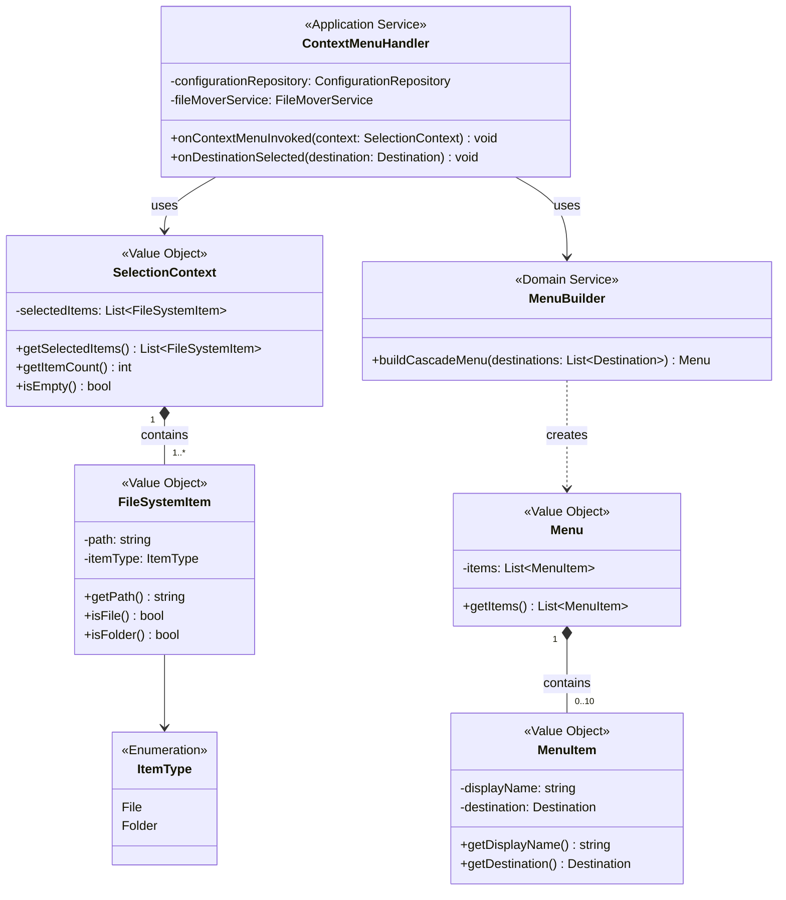
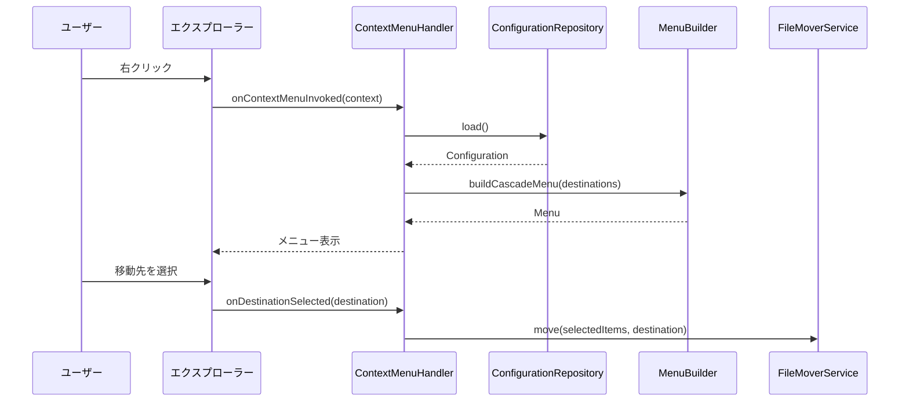

# Unit: コンテキストメニュー

## 概要
Windows 11エクスプローラーの右クリックメニューに「move to」メニューとカスケードメニューを追加するシェル拡張機能。

## 関連ユーザーストーリー
- US-001: コンテキストメニューからファイルを移動する（メニュー表示部分）
- US-002: コンテキストメニューからフォルダーを移動する（メニュー表示部分）
- US-003: 複数ファイル・フォルダーを一括移動する（メニュー表示部分）

## スコープ

### 含まれる機能
- 「move to」メインメニューの登録・表示
- カスケードメニュー（移動先一覧）の表示
- 選択されたファイル/フォルダーパスの取得
- メニュー選択イベントのハンドリング
- ファイル移動処理の呼び出し

### 含まれない機能
- 設定ファイルの読み込み（Unit: 設定管理を利用）
- 実際のファイル移動ロジック（Unit: ファイル移動を呼び出し）
- 同名ファイル確認ダイアログ（Unit: 競合解決を呼び出し）
- シェル登録/アンレジスト手順（インストーラ/登録スクリプト側で実施）

## UI仕様

### メインメニュー
```
┌─────────────────────────┐
│ ...                     │
│ move to              ▶ │
│ ...                     │
└─────────────────────────┘
```

### カスケードメニュー
```
┌──────────────────┐
│ Temp             │
│ Documents        │
│ Archive          │
│ ...（最大10件）   │
└──────────────────┘
```

## 技術仕様

### シェル拡張登録
- Windows 11のコンテキストメニュー拡張として登録（COM 登録: regasm を想定）
- ファイル選択時、フォルダー選択時、複数選択時に表示
- ProgID/GUID は固定し、インストーラ/スクリプトで登録・解除する（アドミン権限前提）
- Explorer 再起動が必要な場合はインストーラ手順に含める

### 配布・登録との境界
- 本ユニットはメニュー生成と選択ハンドリングまでを担当し、レジストリ登録はインストーラ/スクリプトの責務とする
- regasm /codebase（または同等）で登録/解除できるようにする
- 配布物: シェル拡張 DLL、設定ファイル配置先の案内、登録/解除スクリプト

### 処理フロー
```
1. ユーザーが右クリック
2. 「move to」メニュー表示
3. カスケードメニューで設定管理から取得した移動先を表示
4. ユーザーが移動先を選択
5. 選択されたファイル/フォルダーパスとDestinationをDestinationFolderに変換し、ファイル移動Unitに渡す
```

## 受け入れ条件
- [ ] ファイルを右クリックすると「move to」メニューが表示される
- [ ] フォルダーを右クリックすると「move to」メニューが表示される
- [ ] 複数選択時も「move to」メニューが表示される
- [ ] カスケードメニューに設定ファイルの表示名が一覧表示される
- [ ] メニュー項目を選択するとファイル移動処理が呼び出される

## テスト観点
| テストケース | 期待結果 |
|-------------|---------|
| 単一ファイル右クリック | move toメニューが表示される |
| 単一フォルダー右クリック | move toメニューが表示される |
| 複数ファイル選択で右クリック | move toメニューが表示される |
| カスケードメニュー展開 | 設定された移動先が一覧表示される |
| 移動先が0件の場合 | カスケードメニューは空（または「設定なし」表示） |
| 移動先選択 | 正しいパス情報が移動処理に渡される |

## 依存関係
- Unit: 設定管理（移動先リストの取得）
- Unit: ファイル移動（移動処理の呼び出し）

## 成果物
- シェル拡張モジュール
- 統合テストコード

---

## ドメインモデル

### クラス図



### シーケンス図



### ドメインルール

| ルール | 説明 |
|--------|------|
| 選択必須 | 最低1つのファイル/フォルダーが選択されている必要がある |
| メニュー表示 | 移動先が0件でもメニューは表示する（空のカスケード） |
