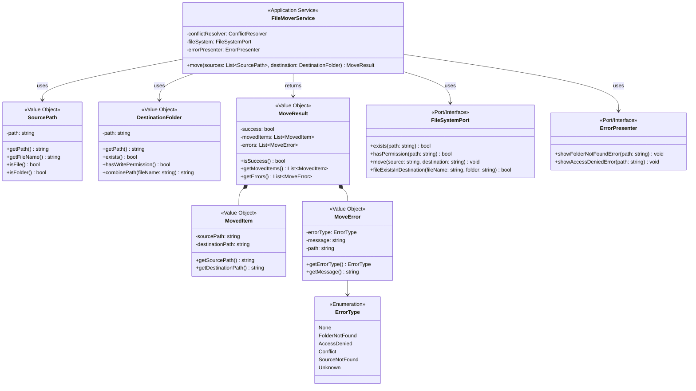
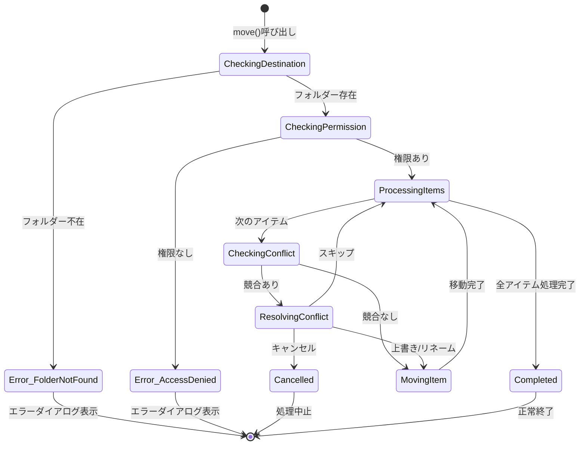

# Unit: ファイル移動

## 概要
ファイルおよびフォルダーを指定された移動先に移動する基本機能。エラーハンドリングを含む。

## 関連ユーザーストーリー
- US-001: コンテキストメニューからファイルを移動する（移動処理部分）
- US-002: コンテキストメニューからフォルダーを移動する（移動処理部分）
- US-003: 複数ファイル・フォルダーを一括移動する（移動処理部分）
- US-005: 移動先フォルダーが存在しない場合のエラー表示
- US-006: アクセス権限エラーの表示

## スコープ

### 含まれる機能
- 単一ファイルの移動
- 単一フォルダーの移動（サブフォルダー・ファイル含む）
- 複数ファイル・フォルダーの一括移動
- 移動先フォルダー存在チェック
- アクセス権限チェック
- エラーダイアログの表示

### 含まれない機能
- 同名ファイル存在時の競合解決（Unit: 競合解決を呼び出し）
- メニュー表示（Unit: コンテキストメニュー）

## 技術仕様

### インターフェース
```
FileMoverService
├── move(sources: List<SourcePath>, destination: DestinationFolder): MoveResult
├── MoveResult
│   ├── success: bool
│   ├── movedItems: List<MovedItem>
│   └── errors: List<MoveError>
└── MoveError
    ├── errorType: ErrorType (None, FolderNotFound, AccessDenied, Conflict, SourceNotFound, Unknown)
    └── message: string
```

### 処理フロー
```
1. 移動先フォルダーの存在チェック
   └── 存在しない → エラーダイアログ表示、処理終了
2. アクセス権限チェック
   └── 権限なし → エラーダイアログ表示、処理終了
3. 各ファイル/フォルダーに対して:
   a. 移動先に同名が存在するかチェック
      └── 存在する → 競合解決Unitを呼び出し
   b. ファイル/フォルダーを移動
4. 完了（通知なし）
```

## UI仕様

### エラーダイアログ：移動先フォルダーが存在しない
```
┌─────────────────────────────────────────────────────────┐
│  ❌ エラー                                        [×]  │
├─────────────────────────────────────────────────────────┤
│                                                         │
│  移動先フォルダーが存在しません。                       │
│                                                         │
│  パス: {移動先パス}                                     │
│                                                         │
│  設定ファイルを確認してください。                       │
│                                                         │
│                        [ OK ]                           │
└─────────────────────────────────────────────────────────┘
```

### エラーダイアログ：アクセス権限がない
```
┌─────────────────────────────────────────────────────────┐
│  ❌ エラー                                        [×]  │
├─────────────────────────────────────────────────────────┤
│                                                         │
│  アクセスが拒否されました。                             │
│                                                         │
│  移動先フォルダーへのアクセス権限がありません。         │
│  パス: {移動先パス}                                     │
│                                                         │
│                        [ OK ]                           │
└─────────────────────────────────────────────────────────┘
```

## 受け入れ条件
- [ ] 単一ファイルを指定フォルダーに移動できる
- [ ] 単一フォルダー（サブフォルダー・ファイル含む）を移動できる
- [ ] 複数ファイル・フォルダーを一括移動できる
- [ ] 移動先フォルダーが存在しない場合、エラーダイアログを表示
- [ ] アクセス権限がない場合、エラーダイアログを表示
- [ ] 移動完了後、通知は表示されない
- [ ] 同名ファイルが存在する場合、競合解決処理を呼び出す

## テスト観点
| テストケース | 期待結果 |
|-------------|---------|
| 単一ファイル移動（正常） | ファイルが移動先に存在する |
| 単一フォルダー移動（正常） | フォルダーとその中身が移動先に存在する |
| 複数ファイル移動（正常） | すべてのファイルが移動先に存在する |
| 移動先フォルダーが存在しない | エラーダイアログが表示される |
| アクセス権限がない | エラーダイアログが表示される |
| 移動元ファイルが移動中に削除された | 適切なエラーハンドリング |
| 同名ファイルが存在 | 競合解決処理が呼び出される |

## 依存関係
- Unit: 競合解決（同名ファイル存在時の処理）

## 成果物
- ファイル移動モジュール
- エラーダイアログ表示モジュール
- 単体テストコード

---

## ドメインモデル

### クラス図



### ステートマシン図



### ドメインルール

| ルール | 説明 |
|--------|------|
| 事前チェック優先 | 移動先の存在・権限は最初にチェック |
| 個別処理 | 各ファイル/フォルダーは個別に処理される |
| 競合時は委譲 | 同名ファイル存在時はConflictResolverに委譲 |
| フォルダー移動 | サブフォルダー・ファイルを含めて再帰的に移動 |
